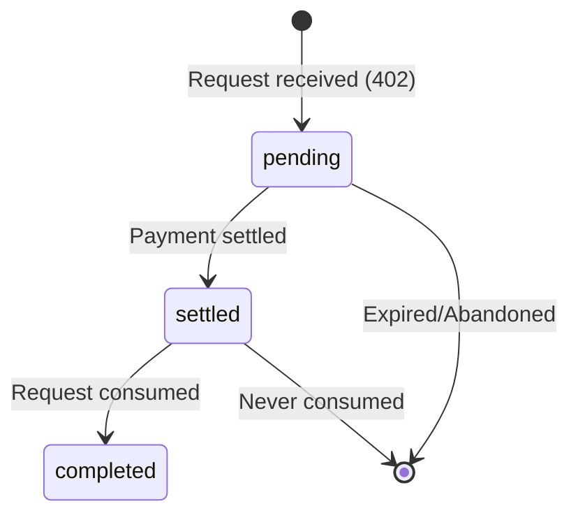

## Overview

The activity endpoints provide visibility into your account's API usage and x402 payment transactions. Use these to monitor costs, debug payment flows, and track API key usage.

## List Transactions

Retrieve recent x402 payment transactions.

<CodeGroup>
```bash cURL
curl https://api.actumx.app/v1/transactions \
  -H "Cookie: your_session_cookie"
```

```javascript JavaScript
const response = await fetch('https://api.actumx.app/v1/transactions', {
  credentials: 'include'
});
const data = await response.json();
```
</CodeGroup>

<Note>
  This endpoint requires session authentication (dashboard login).
</Note>

### Response

<ResponseField name="transactions" type="array">
  List of x402 transaction objects (up to 100 most recent)
  
  <Expandable title="Transaction object">
    <ResponseField name="id" type="string">
      Unique transaction identifier with `x402tx_` prefix
    </ResponseField>
    
    <ResponseField name="status" type="string">
      Transaction status: `pending`, `settled`, or `completed`
      
      - `pending`: Created but not paid
      - `settled`: Paid but not consumed
      - `completed`: Paid and consumed
    </ResponseField>
    
    <ResponseField name="method" type="string">
      HTTP method (e.g., "GET", "POST")
    </ResponseField>
    
    <ResponseField name="endpoint" type="string">
      API endpoint path
    </ResponseField>
    
    <ResponseField name="amountCents" type="number">
      Cost in cents
    </ResponseField>
    
    <ResponseField name="receiptId" type="string | null">
      Receipt ID if settled, null if pending
    </ResponseField>
    
    <ResponseField name="consumedAt" type="string | null">
      ISO 8601 timestamp when request was completed
    </ResponseField>
    
    <ResponseField name="createdAt" type="string">
      ISO 8601 timestamp of transaction creation
    </ResponseField>
    
    <ResponseField name="updatedAt" type="string">
      ISO 8601 timestamp of last update
    </ResponseField>
    
    <ResponseField name="apiKeyId" type="string">
      Associated API key ID
    </ResponseField>
    
    <ResponseField name="apiKeyName" type="string">
      Display name of the API key
    </ResponseField>
    
    <ResponseField name="apiKeyPrefix" type="string">
      API key prefix for identification
    </ResponseField>
  </Expandable>
</ResponseField>

<ResponseExample>
```json
{
  "transactions": [
    {
      "id": "x402tx_abc123",
      "status": "completed",
      "method": "GET",
      "endpoint": "/v1/protected/quote",
      "amountCents": 25,
      "receiptId": "receipt_xyz789",
      "consumedAt": "2024-03-01T10:05:30Z",
      "createdAt": "2024-03-01T10:05:00Z",
      "updatedAt": "2024-03-01T10:05:30Z",
      "apiKeyId": "key_def456",
      "apiKeyName": "Production API Key",
      "apiKeyPrefix": "actumx_live_x"
    },
    {
      "id": "x402tx_def456",
      "status": "pending",
      "method": "GET",
      "endpoint": "/v1/protected/quote",
      "amountCents": 25,
      "receiptId": null,
      "consumedAt": null,
      "createdAt": "2024-03-01T10:00:00Z",
      "updatedAt": "2024-03-01T10:00:00Z",
      "apiKeyId": "key_def456",
      "apiKeyName": "Production API Key",
      "apiKeyPrefix": "actumx_live_x"
    }
  ]
}
```
</ResponseExample>

### Transaction Lifecycle



1. **pending** - Transaction created when endpoint returns 402
2. **settled** - User called `/v1/x402/settle` and payment was deducted
3. **completed** - User retried request with payment proof and received data

---

## Get Usage Events

Retrieve detailed usage events showing API consumption and costs.

<CodeGroup>
```bash cURL
curl https://api.actumx.app/v1/usage \
  -H "Cookie: your_session_cookie"
```

```javascript JavaScript
const response = await fetch('https://api.actumx.app/v1/usage', {
  credentials: 'include'
});
const data = await response.json();
```
</CodeGroup>

<Note>
  This endpoint requires session authentication (dashboard login).
</Note>

### Response

<ResponseField name="events" type="array">
  List of usage event objects (up to 100 most recent)
  
  <Expandable title="Usage Event object">
    <ResponseField name="id" type="string">
      Unique usage event identifier with `usage_` prefix
    </ResponseField>
    
    <ResponseField name="userId" type="string">
      Associated user ID
    </ResponseField>
    
    <ResponseField name="apiKeyId" type="string">
      API key used for the request
    </ResponseField>
    
    <ResponseField name="endpoint" type="string">
      API endpoint path
    </ResponseField>
    
    <ResponseField name="method" type="string">
      HTTP method
    </ResponseField>
    
    <ResponseField name="units" type="number">
      Number of units consumed (typically 1 per request)
    </ResponseField>
    
    <ResponseField name="costCents" type="number">
      Cost in cents for this usage
    </ResponseField>
    
    <ResponseField name="x402TransactionId" type="string">
      Associated x402 transaction ID
    </ResponseField>
    
    <ResponseField name="createdAt" type="string">
      ISO 8601 timestamp
    </ResponseField>
  </Expandable>
</ResponseField>

<ResponseExample>
```json
{
  "events": [
    {
      "id": "usage_abc123",
      "userId": "user_xyz789",
      "apiKeyId": "key_def456",
      "endpoint": "/v1/protected/quote",
      "method": "GET",
      "units": 1,
      "costCents": 25,
      "x402TransactionId": "x402tx_ghi789",
      "createdAt": "2024-03-01T10:05:30Z"
    },
    {
      "id": "usage_def456",
      "userId": "user_xyz789",
      "apiKeyId": "key_def456",
      "endpoint": "/v1/protected/quote",
      "method": "GET",
      "units": 1,
      "costCents": 25,
      "x402TransactionId": "x402tx_jkl012",
      "createdAt": "2024-03-01T09:45:15Z"
    }
  ]
}
```
</ResponseExample>

## Usage vs Transactions

Understand the difference between these two endpoints:

### Transactions Endpoint

Shows the **x402 payment lifecycle**:

- All payment requests (even unpaid ones)
- Payment status (pending → settled → completed)
- Which API key initiated each transaction
- Whether payment was consumed

**Use for**: Debugging payment flows, tracking abandoned payments, monitoring API key activity

### Usage Endpoint

Shows **actual consumption and billing**:

- Only completed/consumed requests
- Exact costs per request
- Usage patterns and history

**Use for**: Billing analysis, cost tracking, usage reporting

<Info>
  Usage events are only created when a transaction reaches the `completed` status (after payment and consumption).
</Info>

## Common Use Cases

### Track Spending by API Key

1. Call `/v1/usage` to get all usage events
2. Group by `apiKeyId` and sum `costCents`
3. Join with API key names from `/v1/api-keys`

### Monitor Abandoned Payments

1. Call `/v1/transactions` to get all transactions
2. Filter for `status: "pending"` older than 10 minutes
3. These represent initiated but unpaid requests

### Debug Payment Issues

1. Call `/v1/transactions` with relevant `apiKeyId`
2. Check transaction status and timestamps
3. Verify `receiptId` matches what client sent
4. Check if transaction was consumed (`consumedAt`)

## Error Codes

| Status | Error | Description |
|--------|-------|-------------|
| 401 | `unauthorized` | Not logged in or session expired |

## Next Steps

<CardGroup cols={2}>
  <Card title="x402 Protocol" icon="dollar-sign" href="/api/x402">
    Understand the payment flow
  </Card>
  <Card title="Billing" icon="credit-card" href="/api/billing">
    View balance and top up credits
  </Card>
  <Card title="API Keys" icon="key" href="/api/api-keys">
    Manage your API keys
  </Card>
  <Card title="Dashboard" icon="chart-line" href="/dashboard/transactions">
    View transactions in the UI
  </Card>
</CardGroup>