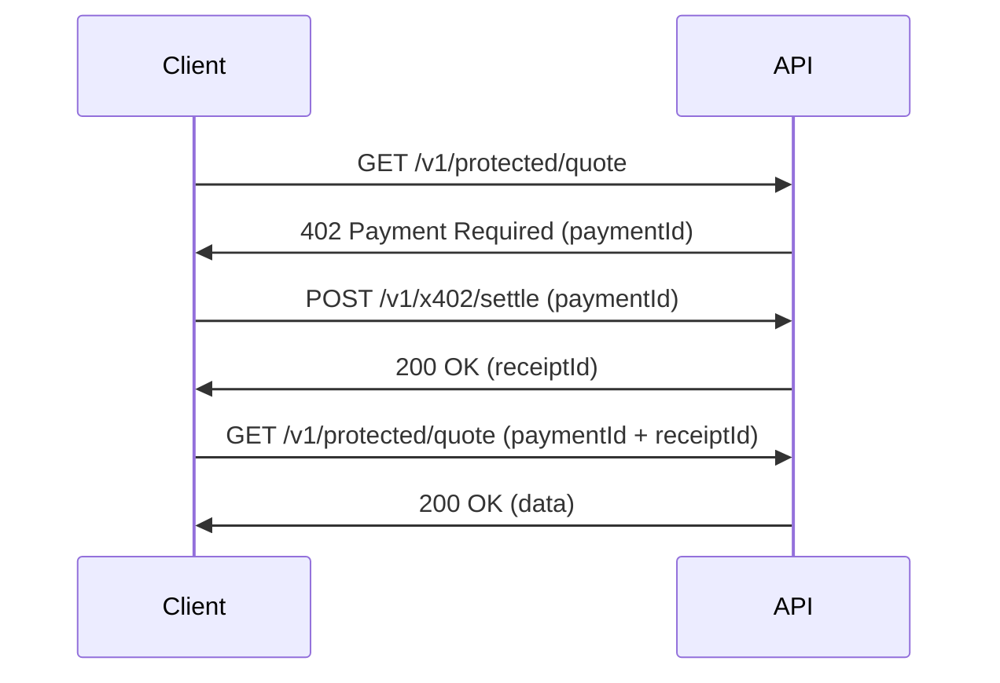

## Overview

The x402 protocol enables machine-readable payment requirements using HTTP 402 (Payment Required). Clients can automatically discover pricing, settle payments, and retry requests without custom per-API billing logic.

<Info>
  x402 allows AI agents and automated systems to pay for API access programmatically. See the [x402 Protocol concept](/concepts/x402-protocol) for details.
</Info>

## Payment Flow

The x402 flow consists of three steps:

1. **Request** - Make initial request, receive 402 with payment details
2. **Settle** - Pay for the request using the settlement endpoint
3. **Retry** - Retry original request with payment proof



---

## Get Protected Quote

A demonstration endpoint that requires payment via x402.

<CodeGroup>
```bash cURL - Initial Request
curl https://api.actumx.app/v1/protected/quote?topic=general \
  -H "x-api-key: actumx_live_abc123..."
```

```bash cURL - With Payment
curl https://api.actumx.app/v1/protected/quote?topic=general \
  -H "x-api-key: actumx_live_abc123..." \
  -H "x-payment-id: x402tx_xyz789" \
  -H "x-payment-proof: receipt_abc123"
```

```javascript JavaScript
// Step 1: Initial request (will get 402)
const response1 = await fetch('https://api.actumx.app/v1/protected/quote?topic=general', {
  headers: {
    'x-api-key': 'actumx_live_abc123...'
  }
});
const payment = await response1.json();

// Step 2: Settle payment
const response2 = await fetch('https://api.actumx.app/v1/x402/settle', {
  method: 'POST',
  headers: {
    'x-api-key': 'actumx_live_abc123...',
    'Content-Type': 'application/json'
  },
  body: JSON.stringify({ paymentId: payment.x402.paymentId })
});
const settlement = await response2.json();

// Step 3: Retry with proof
const response3 = await fetch('https://api.actumx.app/v1/protected/quote?topic=general', {
  headers: {
    'x-api-key': 'actumx_live_abc123...',
    'x-payment-id': settlement.paymentId,
    'x-payment-proof': settlement.receiptId
  }
});
const data = await response3.json();
```
</CodeGroup>

### Query Parameters

<ParamField query="topic" type="string">
  Optional topic for the quote (default: "general")
</ParamField>

### Request Headers (For Retry)

<ParamField header="x-api-key" type="string" required>
  Your API key
</ParamField>

<ParamField header="x-payment-id" type="string">
  Payment ID from the 402 response
</ParamField>

<ParamField header="x-payment-proof" type="string">
  Receipt ID from the settlement response
</ParamField>

### Response (402 Payment Required)

When payment is required, you receive a 402 status with payment details:

<ResponseField name="error" type="string">
  Error code: "payment_required"
</ResponseField>

<ResponseField name="message" type="string">
  Human-readable message
</ResponseField>

<ResponseField name="x402" type="object">
  x402 protocol details
  
  <Expandable title="x402 object">
    <ResponseField name="version" type="string">
      Protocol version ("0.1-draft")
    </ResponseField>
    
    <ResponseField name="paymentId" type="string">
      Unique payment identifier
    </ResponseField>
    
    <ResponseField name="amountCents" type="number">
      Cost in cents (25 cents = $0.25)
    </ResponseField>
    
    <ResponseField name="amountUsd" type="number">
      Cost in USD
    </ResponseField>
    
    <ResponseField name="currency" type="string">
      Currency code ("USD")
    </ResponseField>
    
    <ResponseField name="endpoint" type="string">
      The endpoint being accessed
    </ResponseField>
    
    <ResponseField name="settlementEndpoint" type="string">
      Where to settle the payment
    </ResponseField>
    
    <ResponseField name="facilitator" type="string">
      Payment facilitator identifier
    </ResponseField>
    
    <ResponseField name="expiresAt" type="string">
      ISO 8601 expiration timestamp (10 minutes from creation)
    </ResponseField>
  </Expandable>
</ResponseField>

<ResponseExample>
```json 402 Response
{
  "error": "payment_required",
  "message": "This endpoint requires payment. Settle first and retry with payment proof.",
  "x402": {
    "version": "0.1-draft",
    "paymentId": "x402tx_xyz789",
    "amountCents": 25,
    "amountUsd": 0.25,
    "currency": "USD",
    "endpoint": "/v1/protected/quote",
    "settlementEndpoint": "/v1/x402/settle",
    "facilitator": "internal-simulator",
    "expiresAt": "2024-03-01T10:10:00Z"
  }
}
```
</ResponseExample>

### Response (200 Success)

After successful payment settlement:

<ResponseField name="data" type="object">
  Response data
  
  <Expandable title="data object">
    <ResponseField name="topic" type="string">
      Requested topic
    </ResponseField>
    
    <ResponseField name="insight" type="string">
      Information about x402
    </ResponseField>
    
    <ResponseField name="generatedAt" type="string">
      ISO 8601 timestamp
    </ResponseField>
  </Expandable>
</ResponseField>

<ResponseField name="payment" type="object">
  Payment details
  
  <Expandable title="payment object">
    <ResponseField name="paymentId" type="string">
      Transaction ID
    </ResponseField>
    
    <ResponseField name="receiptId" type="string">
      Receipt ID
    </ResponseField>
    
    <ResponseField name="amountCents" type="number">
      Amount paid
    </ResponseField>
    
    <ResponseField name="status" type="string">
      Payment status ("completed")
    </ResponseField>
  </Expandable>
</ResponseField>

<ResponseExample>
```json 200 Response
{
  "data": {
    "topic": "general",
    "insight": "x402 allows machine-readable payment requirements using HTTP 402 so clients can settle and retry without custom per-API billing logic.",
    "generatedAt": "2024-03-01T10:05:00Z"
  },
  "payment": {
    "paymentId": "x402tx_xyz789",
    "receiptId": "receipt_abc123",
    "amountCents": 25,
    "status": "completed"
  }
}
```
</ResponseExample>

---

## Settle Payment

Settle a payment for an x402 transaction by deducting credits from your account balance.

<CodeGroup>
```bash cURL
curl -X POST https://api.actumx.app/v1/x402/settle \
  -H "x-api-key: actumx_live_abc123..." \
  -H "Content-Type: application/json" \
  -d '{
    "paymentId": "x402tx_xyz789"
  }'
```

```javascript JavaScript
const response = await fetch('https://api.actumx.app/v1/x402/settle', {
  method: 'POST',
  headers: {
    'x-api-key': 'actumx_live_abc123...',
    'Content-Type': 'application/json'
  },
  body: JSON.stringify({
    paymentId: 'x402tx_xyz789'
  })
});
const data = await response.json();
```
</CodeGroup>

### Request Body

<ParamField path="paymentId" type="string" required>
  Payment ID from the 402 response
  
  - Minimum length: 6 characters
  - Format: `x402tx_[random_string]`
</ParamField>

### Response

<ResponseField name="receiptId" type="string">
  Unique receipt identifier (use as payment proof)
</ResponseField>

<ResponseField name="paymentId" type="string">
  The payment ID that was settled
</ResponseField>

<ResponseField name="status" type="string">
  Payment status ("settled")
</ResponseField>

<ResponseField name="amountCents" type="number">
  Amount deducted in cents
</ResponseField>

<ResponseField name="settledAt" type="string">
  ISO 8601 timestamp of settlement
</ResponseField>

<ResponseExample>
```json
{
  "receiptId": "receipt_abc123",
  "paymentId": "x402tx_xyz789",
  "status": "settled",
  "amountCents": 25,
  "settledAt": "2024-03-01T10:05:00Z"
}
```
</ResponseExample>

### Error Responses

#### Insufficient Balance (402)

```json
{
  "error": "insufficient_balance",
  "requiredCents": 25,
  "balanceCents": 10,
  "message": "Top up balance in dashboard before settling this x402 payment."
}
```

#### Payment Not Found (404)

```json
{
  "error": "payment_not_found"
}
```

<Note>
  If a payment is already settled, calling settle again returns the existing receipt details.
</Note>

---

## MCP Server (Model Context Protocol)

ActumX provides an MCP server that exposes agent wallet functionality through the Model Context Protocol.

### MCP Endpoints

- `GET /mcp` - Handle MCP discovery and initialize
- `POST /mcp` - Handle MCP JSON-RPC requests

### Initialize

<CodeGroup>
```bash cURL
curl -X POST https://api.actumx.app/mcp \
  -H "x-api-key: actumx_live_abc123..." \
  -H "Content-Type: application/json" \
  -d '{
    "jsonrpc": "2.0",
    "id": 1,
    "method": "initialize"
  }'
```
</CodeGroup>

#### Response

```json
{
  "jsonrpc": "2.0",
  "result": {
    "protocolVersion": "2024-11-05",
    "capabilities": {
      "tools": {}
    },
    "serverInfo": {
      "name": "actumx-mcp",
      "version": "0.1.0"
    }
  },
  "id": 1
}
```

### List Tools

<CodeGroup>
```bash cURL
curl -X POST https://api.actumx.app/mcp \
  -H "x-api-key: actumx_live_abc123..." \
  -H "Content-Type: application/json" \
  -d '{
    "jsonrpc": "2.0",
    "id": 2,
    "method": "tools/list"
  }'
```
</CodeGroup>

#### Response

```json
{
  "jsonrpc": "2.0",
  "result": {
    "tools": [
      {
        "name": "wallet_balance",
        "title": "Wallet Balance",
        "description": "Return the selected agent wallet balance on Solana.",
        "inputSchema": {
          "type": "object",
          "additionalProperties": false,
          "properties": {
            "agentId": {
              "type": "string",
              "description": "Optional agent id. If omitted, uses your most recent agent."
            }
          }
        }
      }
    ]
  },
  "id": 2
}
```

### Call Tool

<CodeGroup>
```bash cURL
curl -X POST https://api.actumx.app/mcp \
  -H "x-api-key: actumx_live_abc123..." \
  -H "Content-Type: application/json" \
  -d '{
    "jsonrpc": "2.0",
    "id": 3,
    "method": "tools/call",
    "params": {
      "name": "wallet_balance",
      "arguments": {
        "agentId": "agent_abc123"
      }
    }
  }'
```
</CodeGroup>

#### Response

```json
{
  "jsonrpc": "2.0",
  "result": {
    "content": [
      {
        "type": "text",
        "text": "Agent My Agent (7xKzL3kQyH...) balance: 1.500000 SOL (1500000000 lamports)."
      }
    ],
    "structuredContent": {
      "agentId": "agent_abc123",
      "agentName": "My Agent",
      "publicKey": "7xKzL3kQyH...",
      "balanceLamports": 1500000000,
      "balanceSol": 1.5,
      "network": "solana",
      "error": null
    },
    "isError": false
  },
  "id": 3
}
```

### JSON-RPC Error Codes

| Code | Message | Description |
|------|---------|-------------|
| -32001 | API key required | Missing or invalid API key |
| -32600 | Invalid Request | Malformed JSON-RPC request |
| -32601 | Method not found | Unknown JSON-RPC method |
| -32602 | Unknown tool | Tool name not recognized |

## Pricing

Current x402 endpoint pricing:

- `/v1/protected/quote`: **25 cents** per request

Payments are deducted from your account balance. Top up via the [billing endpoint](/api/billing) or dashboard.

## Error Codes

| Status | Error | Description |
|--------|-------|-------------|
| 401 | `missing_or_invalid_api_key` | API key required |
| 402 | `payment_required` | Payment needed (see x402 object) |
| 402 | `invalid_payment_proof` | Payment proof doesn't match |
| 402 | `payment_not_settled` | Payment exists but not settled yet |
| 402 | `insufficient_balance` | Not enough credits to settle |
| 404 | `payment_not_found` | Payment ID doesn't exist |

<Info>
  Payment IDs expire 10 minutes after creation. If expired, make a new request to get a fresh payment ID.
</Info>