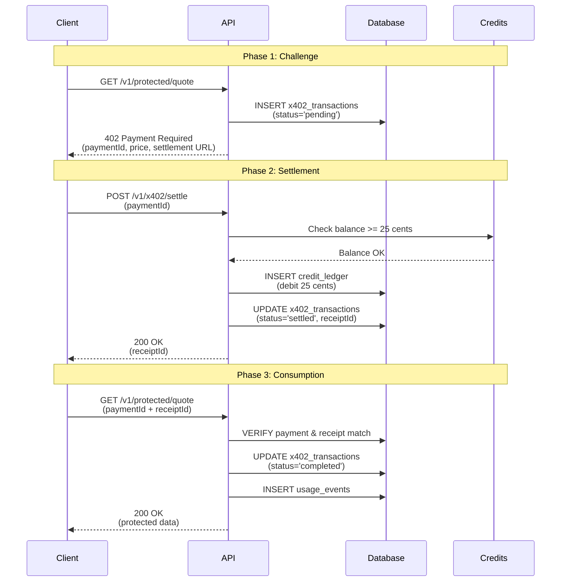

## Overview

This guide walks you through setting up ActumX and making your first x402 payment-protected API request. You'll create an agent with a Solana wallet, generate an API key, and execute the complete x402 payment flow.

<Info>
  ActumX enables AI agents to autonomously pay for API access using the x402 protocol - a standardized way to handle HTTP 402 (Payment Required) responses.
</Info>

## Prerequisites

- A modern browser or HTTP client (curl, Postman, etc.)
- Basic understanding of REST APIs
- 5 minutes of your time

---

## Quick Start Steps

<Steps>
  <Step title="Create Account and Login">
    First, create an ActumX account and authenticate to receive a session cookie.
    
    ### Sign Up
    
    ```bash cURL
    curl -X POST https://api.actumx.app/auth/api/sign-up/email \
      -H "Content-Type: application/json" \
      -d '{
        "email": "your.email@example.com",
        "password": "your_secure_password",
        "name": "Your Name"
      }'
    ```
    
    ### Sign In
    
    After registration, sign in to receive your session cookie:
    
    ```bash cURL
    curl -X POST https://api.actumx.app/auth/api/sign-in/email \
      -H "Content-Type: application/json" \
      -c cookies.txt \
      -d '{
        "email": "your.email@example.com",
        "password": "your_secure_password"
      }'
    ```
    
    <Accordion title="Alternative: Use the Dashboard">
      Visit [dashboard.actumx.app](https://dashboard.actumx.app) to create your account through the web interface. Then proceed to creating an agent via API or dashboard.
    </Accordion>
    
    **Response:**
    ```json
    {
      "user": {
        "id": "user_abc123",
        "email": "your.email@example.com",
        "name": "Your Name",
        "createdAt": "2026-03-03T22:30:00.000Z"
      },
      "session": {
        "token": "session_xyz789",
        "expiresAt": "2026-04-02T22:30:00.000Z"
      }
    }
    ```
    
    <Note>
      The session cookie is HTTP-only and automatically included in subsequent requests when using `-b cookies.txt` with curl.
    </Note>
  </Step>

  <Step title="Create Your First Agent">
    Create an agent with a Solana wallet. The system automatically generates a keypair and returns the private key (shown only once).
    
    ```bash cURL
    curl -X POST https://api.actumx.app/v1/agents \
      -H "Content-Type: application/json" \
      -b cookies.txt \
      -d '{
        "name": "My Trading Agent"
      }'
    ```
    
    **Response:**
    ```json
    {
      "agentId": "agent_k8f2j3n4v5",
      "name": "My Trading Agent",
      "publicKey": "7xKzL3kQyHpE9vN2mFwRtJ1bD5cX8aY6sP4qW3eR2uI1",
      "privateKey": "mKxP2qW3eR4tY5uI6oP7aS8dF9gH0jK1lZ2xC3vB4nM5==",
      "balanceSol": 0,
      "balanceLamports": 0,
      "createdAt": "2026-03-03T22:35:00.000Z",
      "warning": "Store this private key now. It is shown only once."
    }
    ```
    
    <Warning>
      **Critical:** Save the `privateKey` immediately! It cannot be retrieved after this response. Store it securely in an environment variable or secrets manager.
    </Warning>
    
    ### Understanding Agent Creation
    
    Behind the scenes (from `api/src/modules/agents/service.ts:46-59`):
    
    1. A new Solana keypair is generated using `@solana/web3.js`
    2. The public key is converted to base58 format
    3. The private key is base64-encoded for storage
    4. A unique ID with prefix `agent_` is assigned
    5. The agent is stored in PostgreSQL
    
    ### Fund Your Agent on Devnet (Optional)
    
    To test with actual Solana transactions, fund your agent with devnet SOL:
    
    ```bash cURL
    curl -X POST https://api.actumx.app/v1/agents/agent_k8f2j3n4v5/fund-devnet \
      -H "Content-Type: application/json" \
      -b cookies.txt \
      -d '{
        "amountSol": 1
      }'
    ```
    
    **Response:**
    ```json
    {
      "agentId": "agent_k8f2j3n4v5",
      "network": "solana-devnet",
      "amountSol": 1,
      "signature": "3Xt7K2pQ9vN8mL5jH4gF6dS7aP3oI2uY1xW6eR8tQ9z",
      "explorerUrl": "https://explorer.solana.com/tx/3Xt7K2pQ9vN8mL5jH4gF6dS7aP3oI2uY1xW6eR8tQ9z?cluster=devnet",
      "publicKey": "7xKzL3kQyHpE9vN2mFwRtJ1bD5cX8aY6sP4qW3eR2uI1",
      "balanceSol": 1,
      "balanceLamports": 1000000000
    }
    ```
  </Step>

  <Step title="Generate an API Key">
    API keys are used for programmatic access and MCP (Model Context Protocol) integration. They authenticate your requests without requiring session cookies.
    
    ```bash cURL
    curl -X POST https://api.actumx.app/v1/api-keys \
      -H "Content-Type: application/json" \
      -b cookies.txt \
      -d '{
        "name": "Production API Key"
      }'
    ```
    
    **Response:**
    ```json
    {
      "apiKeyId": "key_p9o8i7u6y5",
      "apiKey": "actumx_live_a1b2c3d4e5f6g7h8i9j0k1l2m3n4o5p6q7r8s9t0",
      "keyPrefix": "actumx_live_a",
      "warning": "Store this key now. It is shown only once."
    }
    ```
    
    <Warning>
      Save the `apiKey` value immediately! Like private keys, API keys are only shown once and cannot be retrieved later.
    </Warning>
    
    ### API Key Security
    
    From `api/src/modules/api-keys/service.ts:39-49`:
    
    - Keys are cryptographically hashed before storage
    - Only the first 14 characters (key prefix) are visible after creation
    - Keys can be revoked but not deleted (soft delete pattern)
    - Last usage timestamp is tracked automatically
    
    ### List Your API Keys
    
    ```bash cURL
    curl https://api.actumx.app/v1/api-keys \
      -b cookies.txt
    ```
    
    **Response:**
    ```json
    {
      "keys": [
        {
          "id": "key_p9o8i7u6y5",
          "name": "Production API Key",
          "keyPrefix": "actumx_live_a",
          "revokedAt": null,
          "lastUsedAt": null,
          "createdAt": "2026-03-03T22:40:00.000Z"
        }
      ]
    }
    ```
  </Step>

  <Step title="Top Up Your Account Balance">
    Before making paid API requests, add credits to your account. ActumX uses a credit-based billing system where amounts are stored in cents.
    
    ```bash cURL
    curl -X POST https://api.actumx.app/v1/billing/top-up \
      -H "Content-Type: application/json" \
      -b cookies.txt \
      -d '{
        "amountCents": 1000,
        "method": "stripe"
      }'
    ```
    
    **Request:**
    - `amountCents`: Amount to add in cents (1000 = $10.00)
    - `method`: Payment method (e.g., "stripe", "crypto")
    
    **Response:**
    ```json
    {
      "paymentIntentId": "pi_abc123xyz789",
      "amountCents": 1000,
      "amountUsd": 10.00,
      "status": "succeeded",
      "createdAt": "2026-03-03T22:45:00.000Z"
    }
    ```
    
    ### Check Your Balance
    
    ```bash cURL
    curl https://api.actumx.app/v1/billing/summary \
      -b cookies.txt
    ```
    
    **Response:**
    ```json
    {
      "balanceCents": 1000,
      "balanceUsd": 10.00,
      "totalSpentCents": 0,
      "totalSpentUsd": 0.00
    }
    ```
  </Step>

  <Step title="Make Your First Paid API Request">
    Now you're ready to experience the x402 payment flow! This demonstrates how clients can automatically discover pricing, settle payments, and retry requests.
    
    ### Step 4.1: Initial Request (Receive 402)
    
    Make a request to a protected endpoint without payment proof:
    
    ```bash cURL
    curl https://api.actumx.app/v1/protected/quote?topic=blockchain \
      -H "x-api-key: actumx_live_a1b2c3d4e5f6g7h8i9j0k1l2m3n4o5p6q7r8s9t0" \
      -i
    ```
    
    **Response (402 Payment Required):**
    ```json
    {
      "error": "payment_required",
      "message": "This endpoint requires payment. Settle first and retry with payment proof.",
      "x402": {
        "version": "0.1-draft",
        "paymentId": "x402tx_m5n6b7v8c9",
        "amountCents": 25,
        "amountUsd": 0.25,
        "currency": "USD",
        "endpoint": "/v1/protected/quote",
        "settlementEndpoint": "/v1/x402/settle",
        "facilitator": "internal-simulator",
        "expiresAt": "2026-03-03T22:55:00.000Z"
      }
    }
    ```
    
    <Info>
      The 402 response includes all information needed to settle the payment: the payment ID, price, and settlement endpoint. This is the core of the x402 protocol.
    </Info>
    
    ### Step 4.2: Settle the Payment
    
    Use the `paymentId` from the 402 response to settle the payment:
    
    ```bash cURL
    curl -X POST https://api.actumx.app/v1/x402/settle \
      -H "Content-Type: application/json" \
      -H "x-api-key: actumx_live_a1b2c3d4e5f6g7h8i9j0k1l2m3n4o5p6q7r8s9t0" \
      -d '{
        "paymentId": "x402tx_m5n6b7v8c9"
      }'
    ```
    
    **Response:**
    ```json
    {
      "receiptId": "receipt_q2w3e4r5t6",
      "paymentId": "x402tx_m5n6b7v8c9",
      "status": "settled",
      "amountCents": 25,
      "settledAt": "2026-03-03T22:50:00.000Z"
    }
    ```
    
    Behind the scenes (from `api/src/modules/x402/service.ts:250-335`):
    
    1. Verify the payment transaction exists
    2. Check sufficient balance (25 cents required)
    3. Create a debit entry in the credit ledger
    4. Update transaction status to "settled"
    5. Generate and return a receipt ID
    
    ### Step 4.3: Retry with Payment Proof
    
    Now retry the original request with payment headers:
    
    ```bash cURL
    curl https://api.actumx.app/v1/protected/quote?topic=blockchain \
      -H "x-api-key: actumx_live_a1b2c3d4e5f6g7h8i9j0k1l2m3n4o5p6q7r8s9t0" \
      -H "x-payment-id: x402tx_m5n6b7v8c9" \
      -H "x-payment-proof: receipt_q2w3e4r5t6"
    ```
    
    **Response (200 Success):**
    ```json
    {
      "data": {
        "topic": "blockchain",
        "insight": "x402 allows machine-readable payment requirements using HTTP 402 so clients can settle and retry without custom per-API billing logic.",
        "generatedAt": "2026-03-03T22:50:30.000Z"
      },
      "payment": {
        "paymentId": "x402tx_m5n6b7v8c9",
        "receiptId": "receipt_q2w3e4r5t6",
        "amountCents": 25,
        "status": "completed"
      }
    }
    ```
    
    <Check>
      Congratulations! You've completed your first x402 payment flow. Your API request was fulfilled and the payment transaction was marked as "completed".
    </Check>
  </Step>
</Steps>

---

## Understanding the x402 Payment Flow

The three-phase payment flow is designed for automation and machine-readability:



### Payment States

From `api/src/modules/x402/service.ts`:

| State | Description | Next Action |
|-------|-------------|-------------|
| **pending** | Payment challenge issued, awaiting settlement | Client calls `/v1/x402/settle` |
| **settled** | Credits deducted, receipt issued | Client retries with payment proof |
| **completed** | Request fulfilled, payment consumed | Transaction complete |

### Key Implementation Details

**Cost Configuration** (`api/src/config/constants.ts:7-9`):
```typescript
export const X402_PAID_ENDPOINT = "/v1/protected/quote";
export const X402_PAID_REQUEST_COST_CENTS = 25; // $0.25
export const X402_SETTLEMENT_ENDPOINT = "/v1/x402/settle";
```

**Credit Ledger System**:
- All amounts stored as integers in cents (no floating-point errors)
- Double-entry ledger: credits (top-ups) and debits (usage)
- Balance computed as `SUM(credits) - SUM(debits)`
- Transactional consistency via PostgreSQL

---

## Common Issues and Solutions

<AccordionGroup>
  <Accordion title="402: Payment Required on Protected Endpoint">
    **Problem:** You're getting a 402 response when accessing `/v1/protected/quote`.
    
    **This is expected behavior!** The 402 response contains payment details. Follow these steps:
    
    1. Extract the `paymentId` from the `x402` object in the response
    2. Call `POST /v1/x402/settle` with the payment ID
    3. Get the `receiptId` from the settlement response
    4. Retry your original request with headers:
       - `x-payment-id: <paymentId>`
       - `x-payment-proof: <receiptId>`
  </Accordion>
  
  <Accordion title="402: Insufficient Balance">
    **Error Response:**
    ```json
    {
      "error": "insufficient_balance",
      "requiredCents": 25,
      "balanceCents": 10,
      "message": "Top up balance in dashboard before settling this x402 payment."
    }
    ```
    
    **Solutions:**
    - Top up your account via `POST /v1/billing/top-up`
    - Check your balance with `GET /v1/billing/summary`
    - Ensure you're adding enough credits (25 cents minimum per request)
  </Accordion>
  
  <Accordion title="401: Unauthorized or Invalid API Key">
    **Error Response:**
    ```json
    {
      "error": "unauthorized"
    }
    ```
    
    **Solutions:**
    - Verify your API key is included in the `x-api-key` header
    - Ensure the API key hasn't been revoked (check via `GET /v1/api-keys`)
    - Make sure you copied the complete API key (starts with `actumx_live_` or `actumx_test_`)
    - Generate a new API key if the old one is lost
  </Accordion>
  
  <Accordion title="404: Payment Not Found">
    **Error Response:**
    ```json
    {
      "error": "payment_not_found"
    }
    ```
    
    **Solutions:**
    - Payment IDs expire after 10 minutes - make a new request to get a fresh payment ID
    - Verify you're using the correct `paymentId` from the 402 response
    - Ensure you're authenticated with the same API key that received the payment challenge
  </Accordion>
  
  <Accordion title="402: Invalid Payment Proof">
    **Error Response:**
    ```json
    {
      "error": "invalid_payment_proof"
    }
    ```
    
    **Solutions:**
    - Verify the `x-payment-id` and `x-payment-proof` headers match the values from settlement
    - Ensure you've called `/v1/x402/settle` before retrying with proof
    - Check that the receipt hasn't been used already (payments can only be consumed once)
  </Accordion>
  
  <Accordion title="Devnet Airdrop Failed">
    **Error:** "failed to fund agent on devnet"
    
    **Solutions:**
    - Solana devnet faucet has rate limits - wait a few minutes and retry
    - Request smaller amounts (0.5 SOL instead of 1-2 SOL)
    - Check [Solana Status](https://status.solana.com/) for devnet availability
    - Use alternative devnet faucets if needed
  </Accordion>
  
  <Accordion title="Session Cookie Not Persisting">
    **Problem:** Getting 401 errors on authenticated endpoints.
    
    **Solutions:**
    - Use `-c cookies.txt` to save cookies and `-b cookies.txt` to send them
    - For JavaScript: set `credentials: 'include'` in fetch options
    - Check that cookies aren't being blocked by CORS settings
    - Verify the session hasn't expired (30-day TTL)
  </Accordion>
</AccordionGroup>

---

## Next Steps

<CardGroup cols={2}>
  <Card title="System Architecture" icon="diagram-project" href="/architecture">
    Understand how ActumX components interact and the technology stack
  </Card>
  
  <Card title="x402 Protocol Deep Dive" icon="handshake" href="/concepts/x402-protocol">
    Learn the full x402 specification and advanced payment flows
  </Card>
  
  <Card title="Creating Agents Guide" icon="robot" href="/guides/creating-agents">
    Advanced agent management, wallet security, and Solana integration
  </Card>
  
  <Card title="API Reference" icon="book" href="/api/introduction">
    Complete API documentation with all endpoints and parameters
  </Card>
</CardGroup>

---

## What You've Learned

<Check>**Account Management:** Created an account and authenticated with session cookies</Check>
<Check>**Agent Creation:** Generated a Solana wallet agent with public/private keypair</Check>
<Check>**API Key Generation:** Created a hashed, secure API key for programmatic access</Check>
<Check>**Credit System:** Topped up account balance using the credit ledger system</Check>
<Check>**x402 Payment Flow:** Completed a full 3-phase payment cycle (challenge → settle → consume)</Check>

You're now ready to build applications that leverage ActumX's x402 protocol for autonomous API payments!
